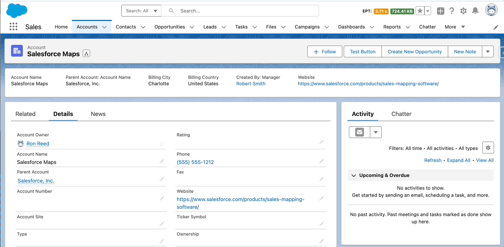

# Custom Highlights Panel

The Custom Highlights Panel provides more flexibility in the number of fields that can be displayed at the top of your record page. In addition, you can display parent (or grandparent, great-grandparent, etc) fields related to the current record.

## Setup

### Create Field Set
Create a Field Set for the object in which you want to display the Custom Highlights Panel. When selecting fields, you can also select fields on any parent records. 

### Add to Lightning Record Page
Go to the Record Page for your object and search for Custom Highlight Panel in the Components search box. Drag the Custom Highlight Panel component onto your page.

### Configure Component Settings
Configure the components settings in the panel to the right: 

1. `Field Set Name`: Select the Field Set Name you created in the previous step.  
2. `Disable Sticky Mode`: Sticky Mode freezes the component to the top of the screen when you are scrolling and it reaches the top. Checking Disable Sticky Mode will not freeze the component.
3. `Standard Highlights Panel is Visible Above the Component`: If you are using the native Highlights Panel to display the Record Name and Action buttons and that component is above this one, make sure this is checked.
4. `Standard Highlights Panel Compact View is Enabled`: If you are using the native Highlights Panel and the Show as Collapsed option is unchecked on that native component, then this option should be checked on the custom component.

## See it in Action

This is what the Custom Highlights Panel looks like after it's been added to your Record Page and configured:

